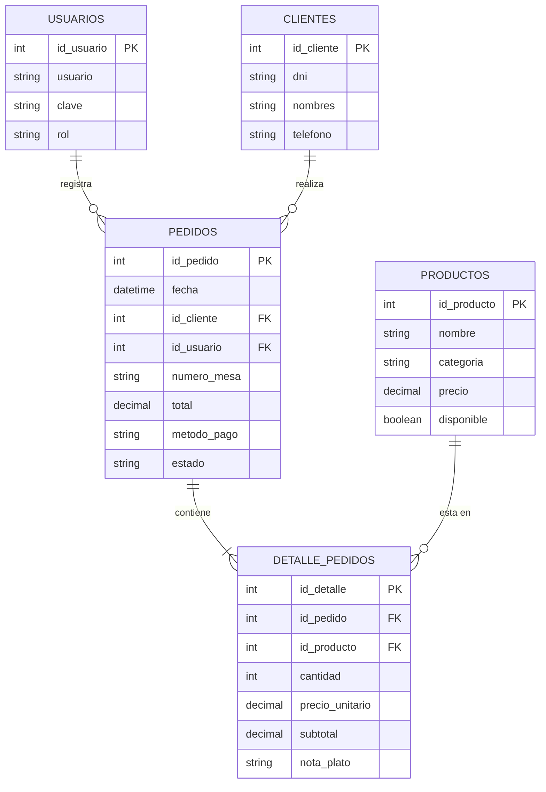

# Proyecto: El Rincón Criollo - Sistema de Gestión de Ventas (MVP)

---

## 1. Visión General del Proyecto
"El Rincón Criollo" es una aplicación de escritorio concebida para la gestión operativa y comercial de un restaurante de comida criolla. El sistema está diseñado para operar de forma 100% local (sin depender de conexión a internet ni de infraestructura en la nube), garantizando inmediatez, disponibilidad y robustez en la caja y el salón.

El objetivo principal es entregar un **Producto Mínimo Viable (MVP) funcional al 70%**, centrado en el ciclo comercial crítico: control de acceso de usuarios, administración de clientes frecuentes, mantenimiento del menú de platos criollos y registro estructurado de pedidos con cálculo instantáneo en memoria RAM y persistencia relacional.

---

## 2. Pila Tecnológica por Capas

El software utiliza un stack tecnológico estandarizado en Python y MySQL, dividiendo las librerías y módulos nativos según la responsabilidad de cada capa:

### 1. Capa de Interfaz Gráfica (Vistas — Bolivar)
- **`customtkinter` (Externa vía pip):** Motor gráfico principal para construir las ventanas de la aplicación, contenedores (`CTkFrame`), botones con estilos, campos de texto (`CTkEntry`) y selectores desplegables (`CTkOptionMenu` / `CTkComboBox`).
- **`tkinter.ttk (Treeview)` (Módulo estándar de Python):** Componente para la maquetación de tablas visuales con encabezados, columnas y barras de desplazamiento, indispensable para listar los clientes, la carta de platos y el carrito temporal de ventas.
- **`tkinter.messagebox` (Módulo estándar de Python):** Sistema de diálogos emergentes nativos para comunicar alertas al usuario (notificaciones de error, confirmaciones y avisos de éxito).
- **`Pillow / PIL` (Externa vía pip, opcional):** Manejo, escalado y renderizado de imágenes (`CTkImage`), utilizado para incorporar el logotipo del restaurante en la pantalla de Login e iconos en el menú de navegación.

### 2. Capa de Lógica y Procesamiento (Controladores — Israel)
- **`decimal (Decimal)` (Módulo estándar de Python):** Manejo financiero de las sumas de dinero, multiplicaciones de cantidad por precio y acumulación del total general en la memoria RAM con precisión decimal exacta, eliminando errores de redondeo por punto flotante.
- **`re` (Módulo estándar de Python):** Motor de expresiones regulares para la validación de formatos de texto antes de procesar la información (asegurar que el DNI tenga estrictamente 8 dígitos numéricos o validar teléfonos).
- **`datetime` (Módulo estándar de Python):** Captura de la fecha y hora exacta del sistema (`datetime.now()`) al momento en que se consolida y registra formalmente una venta.
- **Estructuras Nativas de Python (`list`, `dict`):** Administración del estado del pedido en la memoria RAM (carrito de compras temporal), permitiendo agregar platos, modificar cantidades o remover ítems antes de proceder al guardado en base de datos.

### 3. Capa de Base de Datos y Persistencia (Modelos — Jybran)
- **`mysql-connector-python` (Driver oficial vía pip):** Conector que establece el puente de comunicación entre Python y el servidor MySQL; provee los objetos de conexión (`connect`), cursores para ejecución de sentencias preparadas seguras (`%s`) y el control transaccional (`commit()` y `rollback()`).
- **`mysql.connector.errors`:** Submódulo para el control preventivo y captura de excepciones nativas de la base de datos (caídas del servicio MySQL en XAMPP, fallos de red local o duplicidad de llaves primarias/únicas).
- **`MySQL Server` (Servicio local vía XAMPP):** Motor de base de datos relacional donde residen físicamente las tablas del restaurante.
- **`MySQL Workbench / phpMyAdmin`:** Herramientas visuales de administración para ejecutar el script inicial (`schema.sql`), auditar la integridad referencial y verificar los datos almacenados.

---

## 3. Modelo de Datos Central (Entidad - Relación)

El sistema opera sobre 5 entidades relacionales estructuradas:

---

## 4. Metodología de Trabajo y Distribución del Equipo

| Integrante | Rol Principal | Tecnologías y Herramientas a su Cargo | Área de Trabajo |
| :--- | :--- | :--- | :--- |
| **Jybran** | Modelo / Base de Datos | `mysql-connector-python`, MySQL en XAMPP, phpMyAdmin, SQL preparado (`%s`). | `database/`, `models/` |
| **Bolivar** | Vista / Interfaz | `customtkinter`, `ttk.Treeview`, `tkinter.messagebox`, `Pillow (PIL)`. | `views/` |
| **Israel** | Controlador / Lógica | `decimal (Decimal)`, `re`, `datetime`, estructuras en RAM (`list`, `dict`). | `controllers/`, `main.py` |
| **Alex** | Líder de Proyecto / QA | `casos_de_prueba.xlsx`, auditoría de precisión, pruebas de estrés y manual técnico. | `docs/` |

---

## 5. Reglas de Oro de Convivencia Técnica
1. **Librerías bien acotadas:** Las vistas solo importan librerías visuales (`customtkinter`, `ttk`, `messagebox`); no tocan conectores de base de datos ni lógica financiera.
2. **Precisión financiera obligatoria:** Todo cálculo monetario en los controladores debe emplear `Decimal` para evitar desajustes de céntimos en caja.
3. **Consultas preparadas obligatorias:** Las sentencias SQL en los modelos deben usar parámetros seguros (`%s`) para evitar vulnerabilidades y errores de formato.
4. **Respeto a las carpetas:** Ningún miembro modifica archivos fuera de su módulo de trabajo sin previa autorización del líder.
