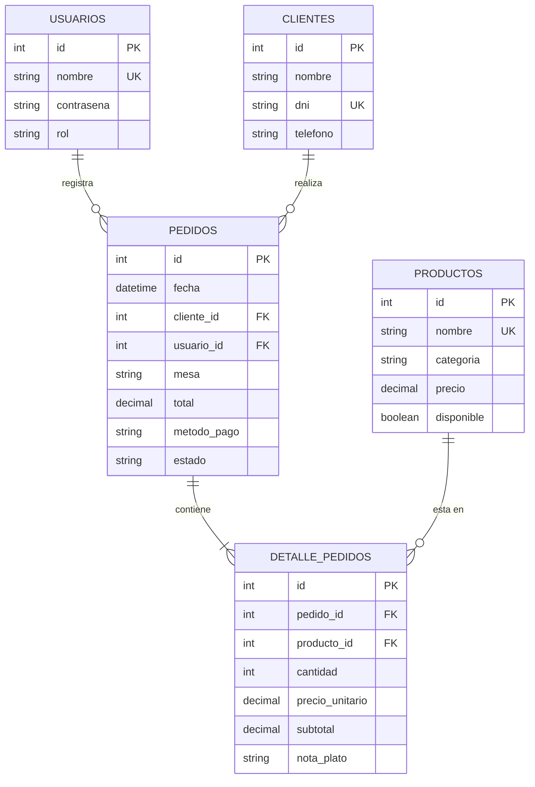

# Proyecto: El Rincón Criollo - Sistema de Gestión de Salón y Ventas (MVP)

---

## 1. Visión General del Proyecto
"El Rincón Criollo" es una aplicación de escritorio desarrollada como **Producto Mínimo Viable (MVP)** para la gestión comercial y operativa de un restaurante de comida tradicional peruana. El sistema opera de forma local enlazado con un servidor MySQL bajo XAMPP, garantizando inmediatez, disponibilidad permanente y robustez en la atención de comensales en salón y el despacho rápido en caja sin depender de conexiones a internet.

---

## 2. Alcance del Proyecto (Scope) y Limitaciones del Sistema

Para garantizar transparencia técnica y delimitar las fronteras operativas del software, se define formalmente lo que el sistema abarca y sus restricciones de diseño:

### A. Alcance General (Qué SÍ abarca el sistema):
* **Control de Acceso y Sesión:** Autenticación de personal con perfiles diferenciados (`administrador` y `vendedor`), retención de la sesión activa en memoria y trazabilidad del cajero en cada comprobante.
* **Directorio de Clientes:** Registro y consulta de comensales frecuentes con validación estricta de DNI de 8 dígitos numéricos y disponibilidad de un cliente genérico predeterminado (*Público General*) para ventas al paso.
* **Gestión Integral de la Carta (CRUD Completo):** Registro de platos por categorías fijas, actualización de precios en `Decimal`, edición de datos, conmutación de stock en caliente (`Disponible` / `Agotado`) y **protección contra borrado de platos con ventas pasadas**.
* **Terminal de Salón y Comandas en Memoria RAM:** Carrito temporal dinámico con precisión aritmética monetaria exacta (`Decimal`), sin errores de redondeo de punto flotante, y captura de observaciones de cocina (`nota_plato`).
* **Control de Ocupación de Salón:** Gestión del estado de mesas físicas (`Mesa 01` a `Mesa 06`), impidiendo la apertura de comandas duplicadas en mesas ocupadas.
* **Flujo Comercial Dual:**
  - *Guardar Comanda (Pendiente):* Envía el pedido a cocina y reserva la mesa como ocupada para comensales en salón.
  - *Cobrar al Instante (Pagado):* Registra la venta y emite el comprobante de inmediato con mesa liberada.
* **Historial de Ventas y Liquidación:** Módulo dedicado para auditar todos los comprobantes emitidos, consultar los platos consumidos y liquidar comandas pendientes, liberando la mesa asignada en tiempo real.
* **Operatividad Local Autónoma (Offline):** Funcionamiento sobre red local o equipo único con MySQL bajo XAMPP, inmune a caídas de internet.

### B. Limitaciones Generales del Sistema (Qué NO abarca / Trabajo Futuro):
* **Sin Facturación Electrónica Fiscal (SUNAT):** El sistema emite tickets, comandas y comprobantes de control interno para el restaurante, pero no se conecta mediante web services (SOAP/REST) a la SUNAT ni genera archivos XML con firma digital ni códigos QR tributarios oficiales.
* **Sin Integración a Pasarelas de Pago Bancarias en Vivo:** El registro de las modalidades de cobro (*Efectivo, Yape, Plin, Tarjeta*) es de carácter declarativo/manual por el cajero; el software no se conecta mediante API con Niubiz, Izipay ni bancos para verificar transacciones con datáfono en tiempo real.
* **Sin Control de Stock por Receta (Kardex de Insumos):** El sistema controla la disponibilidad del plato terminado en la carta (`Disponible` o `Agotado`), pero no descuenta gramos de carne, verduras o litros de insumos de un inventario de almacén por receta.
* **Sin Comandera Móvil para Mozos:** Es una aplicación de escritorio nativa monolítica (desarrollada con CustomTkinter para Windows/Linux/macOS); los mozos y cajeros operan desde terminales fijas o laptops, no desde una app web o móvil en smartphones.
* **Distribución de Salón Fija:** La lista de mesas físicas está preconfigurada en el sistema (`Mesa 01 a 06`); no incluye un editor gráfico interactivo de planos ni creación dinámica de mesas desde la interfaz.
* **Arquitectura Monosede:** Diseñado para operar en un único restaurante físico; no incluye sincronización distribuida en la nube para múltiples sucursales ni franquicias.

---

## 3. Pila Tecnológica por Capas (Patrón MVC)

El software sigue una estricta separación de responsabilidades dividida entre los integrantes del equipo:

### 1. Capa de Presentación / Vistas (Bolivar)
- **`customtkinter`:** Motor gráfico principal para maquetar interfaces modernas en tema oscuro/claro, con tarjetas modulares (`CTkFrame`), botones ergonómicos de gran escala (`height=44`), cajas de texto (`CTkEntry`) y selectores desplegables (`CTkComboBox`).
- **Formularios Modales (`CTkToplevel`):** Ventanas emergentes desacopladas y centradas para el registro de clientes y creación/edición de platos, manteniendo las pantallas principales limpias y despejadas.
- **`tkinter.ttk (Treeview)`:** Tablas con encabezados de columna y barras de desplazamiento (`Scrollbar`) para visualizar clientes, la carta gastronómica, el carrito temporal y el historial de ventas.
- **`tkinter.messagebox`:** Diálogos nativos de confirmación, advertencia y éxito.

### 2. Capa de Lógica y Negocio / Controladores (Israel)
- **`decimal (Decimal)`:** Procesamiento financiero obligatorio de importes, subtotales y total acumulado con precisión matemática exacta a 2 decimales, eliminando discrepancias de céntimos por punto flotante.
- **`re` (Expresiones Regulares):** Validación preventiva de formatos de texto (DNI de exactamente 8 números mediante `^\d{8}$` y teléfonos).
- **`datetime`:** Registro de la marca de tiempo oficial del sistema (`datetime.now()`) al emitir cualquier comanda o comprobante.
- **Estructuras en Memoria RAM (`list`, `dict`):** Administración del estado volátil del carrito temporal y control en vivo de la ocupación de mesas.

### 3. Capa de Datos y Persistencia / Modelos (Jybran)
- **`mysql-connector-python`:** Driver oficial para conectar Python con MySQL, con cursores parametrizados seguros (`%s`) para erradicar cualquier riesgo de inyección SQL.
- **Transacciones Atómicas (`commit` / `rollback`):** Garantía de atomicidad (todo o nada) en la persistencia de pedidos y sus renglones de detalle.
- **`MySQL Server` (Servicio local vía XAMPP):** Motor relacional donde residen físicamente las tablas del restaurante.
- **`phpMyAdmin` / `MySQL Workbench`:** Plataformas de gestión para la ejecución del script `schema.sql` y auditoría de datos.

### 4. Capa de Liderazgo, Aseguramiento de Calidad y Documentación (Alex)
- **Control de Calidad (QA):** Verificación de cumplimiento de las reglas de negocio, pruebas funcionales de extremo a extremo (End-to-End) y auditoría de no regresión.
- **Documentación Técnica Oficial:** Redacción y mantenimiento de las reglas de negocio, manual técnico con diagramas E-R y guías de despliegue.

---

## 4. Modelo de Datos Relacional (Diagrama E-R)

El sistema opera sobre 5 entidades relacionales normalizadas:

---

## 5. Distribución del Equipo y Áreas de Trabajo

| Integrante | Rol Oficial | Herramientas a su Cargo | Área de Trabajo |
| :--- | :--- | :--- | :--- |
| **Jybran** | Modelo / Base de Datos | `mysql-connector-python`, MySQL en XAMPP, phpMyAdmin, SQL parametrizado (`%s`). | `database/`, `models/` |
| **Bolivar** | Vista / Interfaz Gráfica | `customtkinter`, `CTkToplevel` (Modales), `ttk.Treeview`, `tkinter.messagebox`. | `views/` |
| **Israel** | Controlador / Lógica | `decimal (Decimal)`, `re`, `datetime`, estructuras en memoria RAM (`list`, `dict`). | `controllers/`, `main.py` |
| **Alex** | Líder de Proyecto / QA | Auditoría de reglas de negocio, pruebas End-to-End, manual técnico y despliegue. | `docs/` |

---

## 6. Reglas de Oro de Convivencia Técnica
1. **Separación estricta de capas (MVC):** Las vistas solo importan widgets gráficos; los controladores orquestan la lógica sin escribir SQL; los modelos gestionan MySQL sin importar librerías visuales.
2. **Precisión financiera obligatoria:** Todo cálculo monetario utiliza `Decimal` para garantizar exactitud al céntimo.
3. **Consultas 100% parametrizadas:** Las sentencias SQL usan parámetros seguros (`%s`) para evitar vulnerabilidades.
4. **Protección de la integridad contable:** Los platos con ventas previas no pueden eliminarse físicamente de la base de datos para no corromper balances históricos.
5. **Control de salón sin duplicidad:** Una mesa ocupada no puede aceptar nuevas comandas hasta que la cuenta pendiente sea liquidada.
