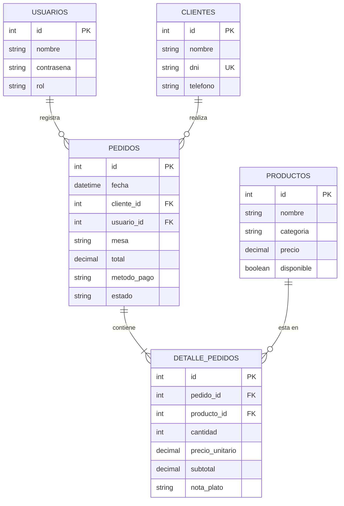

# Manual Técnico y de Usuario: El Rincón Criollo

---

## 1. Introducción y Arquitectura del Sistema
"El Rincón Criollo" es una aplicación de escritorio desarrollada en Python bajo el patrón arquitectónico **Modelo - Vista - Controlador (MVC)**, con persistencia en **MySQL Server** a través del driver oficial `mysql-connector-python`.

### Separación de Responsabilidades:
```text
      [Usuario / Operador]
               │
               ▼
       ┌───────────────┐
       │     VISTA     │  (CustomTkinter + ttk.Treeview)
       └───────┬───────┘
               │  Eventos de interfaz
               ▼
       ┌───────────────┐
       │  CONTROLADOR  │  (Lógica de negocio, RAM, Decimal, regex re)
       └───────┬───────┘
               │  Consultas y Transacciones
               ▼
       ┌───────────────┐
       │    MODELO     │  (Consultas SQL parametrizadas %s)
       └───────┬───────┘
               │
               ▼
       ┌───────────────┐
       │     MySQL     │  (Tablas relacionales vía XAMPP)
       └───────────────┘
```

### 1.1 Estructura del Proyecto y Justificación de Buenas Prácticas de Ingeniería

El proyecto ha sido estructurado siguiendo estándares de la industria del software para garantizar mantenibilidad, seguridad y trabajo colaborativo:

#### 1. ¿Por qué el Patrón Arquitectónico MVC (`models/`, `views/`, `controllers/`)?
* **Principio de Responsabilidad Única (SRP):** Cada módulo se especializa en una tarea. La vista no sabe de SQL, el modelo no sabe de botones y el controlador actúa como árbitro intermediario.
* **Desacoplamiento y Escalabilidad:** Si el día de mañana se decide cambiar la interfaz gráfica a una aplicación web (ej. Django o FastAPI) o cambiar MySQL por PostgreSQL, no es necesario reescribir todo el sistema: únicamente se sustituye la capa correspondiente sin alterar la lógica de negocio.
* **Trabajo en Equipo sin Conflictos de Git:** Permite que varios programadores colaboren simultáneamente en paralelo (Jybran en base de datos, Bolivar en diseño gráfico e Israel en lógica financiera) sin pisarse archivos ni generar colisiones de código.

#### 2. ¿Por qué existe `main.py` como Punto de Entrada Único?
* **Centralización del Ciclo de Vida:** `main.py` es el único archivo ejecutable del sistema. Su propósito es orquestar el arranque: inicializa las ventanas, instancia los modelos y controladores, inyecta dependencias e inicia el bucle de eventos (`mainloop`).
* **Prevención de Código Huérfano y Dependencias Circulares:** Al tener un orquestador central, ningún controlador o vista se ejecuta de forma aislada sin su contexto adecuado.

#### 3. ¿Por qué se utiliza un Entorno Virtual (`.venv`)?
* **Aislamiento de Dependencias:** Python instala por defecto librerías a nivel global en el sistema operativo. Un entorno virtual crea una "caja de arena" (sandbox) local exclusiva para este proyecto.
* **Prevención de Conflictos de Versiones:** Evita que actualizaciones de librerías de otros proyectos en la misma computadora rompan el funcionamiento de `customtkinter` o `mysql-connector-python`.

#### 4. ¿Por qué existe `requirements.txt`?
* **Reproducibilidad Determinista:** Registra con exactitud las librerías externas que el proyecto necesita.
* **Portabilidad Inmediata:** Permite que cualquier desarrollador, evaluador o administrador de sistemas clone el repositorio y, con un solo comando (`pip install -r requirements.txt`), reproduzca exactamente el mismo entorno de ejecución en segundos.

#### 5. ¿Por qué se utilizan Variables de Entorno (`.env` y `.env.example`)?
* **Seguridad y Confidencialidad de Credenciales:** Las contraseñas, usuarios y puertos del servidor MySQL nunca deben subirse al control de versiones de GitHub. El archivo `.env` está expresamente excluido en el `.gitignore`.
* **Flexibilidad por Estación de Trabajo:** Cada miembro del equipo puede tener configuraciones de XAMPP distintas en su máquina (por ejemplo, el puerto `3306` en una laptop y el puerto `3307` en otra) sin modificar ni una sola línea de código fuente. La plantilla pública `.env.example` documenta los parámetros requeridos sin exponer datos sensibles.

### 1.2 Delimitación Técnica: Alcance y Limitaciones del Sistema

#### Alcance General del Software (In-Scope):
1. **Autenticación y Sesión:** Validación contra MySQL con asignación de roles (`administrador` y `vendedor`) y auditoría del cajero activo en cada comprobante emitido.
2. **Directorio de Clientes:** Validación de DNI con expresiones regulares (`^\d{8}$`), unicidad en base de datos y disponibilidad del cliente genérico `Público General`.
3. **Carta de Platos Criollos (CRUD Completo):** Creación, modificación de precios, conmutación de stock en caliente (`Disponible` / `Agotado`) y bloqueo de borrado de platos con ventas históricas.
4. **Terminal de Salón y Comandas:** Carrito temporal en RAM con cálculo exacto en `Decimal` a dos decimales y captura de notas especiales de cocina.
5. **Control de Ocupación de Salón:** Estado dinámico de mesas fijas (`Mesa 01 a 06`), previniendo la duplicidad de cuentas en una misma mesa.
6. **Flujo Comercial Dual:** Soporte nativo para despacho inmediato (`Pagado`) y consumo en salón con mesa ocupada (`Pendiente`).
7. **Historial de Ventas ("Ver Pedidos"):** Consulta de comprobantes emitidos, auditoría de detalle de consumos y cobro de pedidos pendientes con liberación inmediata de mesa.
8. **Operación 100% Offline:** Despliegue en red local o máquina única bajo XAMPP, inmune a cortes de internet.

#### Limitaciones del Software (Out-of-Scope / Trabajo Futuro):
1. **Facturación Fiscal Electrónica (SUNAT):** Emite comprobantes y comandas internas, pero no se integra vía web service (SOAP/REST) a la SUNAT ni genera archivos XML firmados digitalmente.
2. **Pasarelas de Pago Bancarias en Vivo:** El registro del método de pago (*Efectivo, Yape, Plin, Tarjeta*) es de carácter declarativo por el cajero; no se conecta vía API a Niubiz o Izipay para confirmar transacciones de datáfono automáticamente.
3. **Control de Stock por Receta (Kardex de Insumos):** Administra la disponibilidad del plato terminado en la carta, pero no descuenta ingredientes ni insumos de un almacén por receta.
4. **Comandera Móvil:** Aplicación de escritorio nativa monolítica (CustomTkinter); no incluye app móvil ni web responsiva para mozos en smartphones.
5. **Distribución Física de Salón Fija:** Las mesas físicas están predefinidas en el código (`Mesa 01 a 06`); no incluye editor gráfico de planos.
6. **Monosede:** Operación diseñada para un único local físico, sin sincronización distribuida en la nube para múltiples sucursales.

---

## 2. Modelo Entidad - Relación (E-R)



---

## 3. Diccionario de Datos

### Tabla: `usuarios`
| Campo | Tipo | Nulo | Clave | Descripción |
| :--- | :--- | :---: | :---: | :--- |
| `id` | `INT` | NO | PK | Identificador único autoincremental del usuario. |
| `nombre` | `VARCHAR(50)` | NO | - | Nombre de usuario para iniciar sesión. |
| `contrasena` | `VARCHAR(100)` | NO | - | Clave de acceso al sistema. |
| `rol` | `VARCHAR(20)` | NO | - | Rol del usuario (`administrador`, `vendedor`). |

### Tabla: `clientes`
| Campo | Tipo | Nulo | Clave | Descripción |
| :--- | :--- | :---: | :---: | :--- |
| `id` | `INT` | NO | PK | Identificador único del cliente. |
| `nombre` | `VARCHAR(100)` | NO | - | Nombres y apellidos completos. |
| `dni` | `VARCHAR(8)` | NO | UK | Documento de identidad (único, 8 dígitos). |
| `telefono` | `VARCHAR(15)` | SÍ | - | Teléfono o celular de contacto. |

### Tabla: `productos`
| Campo | Tipo | Nulo | Clave | Descripción |
| :--- | :--- | :---: | :---: | :--- |
| `id` | `INT` | NO | PK | Identificador del plato o bebida. |
| `nombre` | `VARCHAR(100)` | NO | - | Nombre del plato criollo. |
| `categoria` | `VARCHAR(50)` | NO | - | Categoría (Entradas, Platos de Fondo, etc.). |
| `precio` | `DECIMAL(10,2)` | NO | - | Precio de venta al público en Soles. |
| `disponible` | `BOOLEAN` | NO | - | Estado en carta (`TRUE` activo, `FALSE` agotado). |

### Tabla: `pedidos`
| Campo | Tipo | Nulo | Clave | Descripción |
| :--- | :--- | :---: | :---: | :--- |
| `id` | `INT` | NO | PK | Número de comanda / ticket de venta. |
| `cliente_id` | `INT` | SÍ | FK | Referencia al cliente que realiza el pedido. |
| `usuario_id` | `INT` | SÍ | FK | Referencia al cajero/usuario que cobró. |
| `mesa` | `VARCHAR(20)` | NO | - | Ubicación o número de mesa (*Mesa 01*, *Barra*). |
| `metodo_pago` | `VARCHAR(20)` | SÍ | - | Modalidad de cobro (*Efectivo*, *Yape*, *Tarjeta*). |
| `total` | `DECIMAL(10,2)` | NO | - | Monto total general liquidado. |
| `estado` | `VARCHAR(20)` | NO | - | Estado de la venta (*Pagado*, *Pendiente*). |
| `fecha` | `DATETIME` | NO | - | Marca de tiempo generada automáticamente. |

### Tabla: `detalle_pedidos`
| Campo | Tipo | Nulo | Clave | Descripción |
| :--- | :--- | :---: | :---: | :--- |
| `id` | `INT` | NO | PK | Identificador del renglón de venta. |
| `pedido_id` | `INT` | NO | FK | Referencia al pedido cabecera. |
| `producto_id`| `INT` | NO | FK | Referencia al plato consumido. |
| `cantidad` | `INT` | NO | - | Unidades solicitadas (mínimo 1). |
| `precio_unitario`| `DECIMAL(10,2)`| NO | - | Precio congelado al momento de la venta. |
| `subtotal` | `DECIMAL(10,2)`| NO | - | Subtotal calculado (`cantidad * precio_unitario`). |
| `nota_plato` | `VARCHAR(150)`| SÍ | - | Observación para cocina (*sin ají*, *término 3/4*). |

---

## 4. Requerimientos de Instalación y Despliegue

### Requisitos de Software:
* **Sistema Operativo:** Windows 10/11, macOS o Linux.
* **Python:** Versión 3.10 o superior instalada.
* **Servidor Local:** XAMPP (con servicios Apache y MySQL activados).

### Pasos de Despliegue:
1. **Clonar el proyecto:**
   ```bash
   git clone https://github.com/Alex-Cardenas76/Restaurante_Criollo.git
   cd Restaurante_Criollo
   ```
2. **Crear y activar el entorno virtual:**
   ```powershell
   python -m venv .venv
   .venv\Scripts\activate
   ```
3. **Instalar dependencias oficiales:**
   ```powershell
   pip install -r requirements.txt
   ```
4. **Configurar el archivo `.env`:**
   ```powershell
   copy .env.example .env
   ```
   *Verificar que `DB_HOST=localhost`, `DB_PORT=3306`, `DB_USER=root`, `DB_PASSWORD=` y `DB_NAME=el_rincon_criollo`.*
5. **Configurar la base de datos en phpMyAdmin:**
   - Iniciar **Apache** y **MySQL** en el panel de XAMPP.
   - Navegar a `http://localhost/phpmyadmin`.
   - Crear la base de datos: `el_rincon_criollo`.
   - Importar y ejecutar el script [database/schema.sql](file:///C:/Users/ACER/Desktop/Criollo/database/schema.sql).
6. **Ejecutar el software:**
   ```powershell
   python main.py
   ```

---

## 5. Guía de Usuario (Manual de Operación)

### 1. Inicio de Sesión (Login)
* Ingrese el usuario `admin` y la contraseña `admin123`.
* Presione **"Ingresar al Sistema"**. Si los datos son válidos, accederá al panel principal.

### 2. Panel Principal (Dashboard)
* En la parte superior derecha se exhibe el usuario activo y su rol actual.
* El menú lateral izquierdo permite alternar instantáneamente entre:
  * **👥 Gestión de Clientes**
  * **🍲 Carta de Productos**
  * **📝 Caja y Pedidos**
  * **📜 Historial de Ventas ("Ver Pedidos")**
  * **🚪 Cerrar Sesión**

### 3. Registro y Gestión de Clientes
* Para registrar un nuevo comensal, presione el botón **"+ Nuevo Cliente"**.
* Se abrirá una ventana emergente (modal) solicitando DNI (8 dígitos), Nombres y Teléfono.
* Presione **"Guardar Cliente"**. El modal se cerrará automáticamente y la tabla principal reflejará de inmediato al nuevo cliente.
* Si el DNI ya existe, el sistema bloqueará el registro con una alerta clara.

### 4. Gestión Integral de la Carta (CRUD de Platos)
* **+ Nuevo Plato:** Presione el botón **"+ Nuevo Plato"**. Se abrirá una ventana modal ergonómica para ingresar nombre, categoría (Entradas, Platos de Fondo, Guarniciones, Bebidas, Postres), precio y disponibilidad inicial.
* **✏️ Editar Plato:** Seleccione un plato de la tabla y presione **"✏️ Editar Plato"**. El modal se abrirá con todos los datos precargados para actualizar precios, corregir ortografía o reclasificar categorías. Los pedidos ya cobrados en el pasado conservan su precio histórico sin alterarse.
* **🔄 Disponibilidad (Agotado / Disponible):** Si un plato se agota momentáneamente en cocina, seleccione la fila del plato y presione **"🔄 Disponibilidad"**.
  * Si estaba `Disponible`, cambiará a `Agotado` y quedará bloqueado de la vista de toma de comandas.
  * Si vuelve a haber stock, presiónelo nuevamente para reactivarlo a `Disponible`.
* **🗑️ Eliminar Plato:** Seleccione un plato y presione **"🗑️ Eliminar"**.
  * Si el plato nunca se ha vendido, se eliminará definitivamente tras confirmar la acción.
  * Si el plato ya tiene ventas registradas en el historial contable, el sistema protegerá la integridad contable impidiendo su borrado físico e indicando que use el cambio de disponibilidad a `Agotado`.

### 5. Registro de Pedidos (Comanda vs Cobro Inmediato)
1. **Selección de Mesa y Cliente:**
   * Seleccione la mesa en el menú desplegable. Las opciones muestran claramente el estado: `Mesa 01 (Disponible)` o `Mesa 01 (Ocupada - Pedido #X)`. Los pedidos para despacho rápido se identifican como `Para Llevar`.
   * Si intenta abrir una comanda en una mesa ocupada, el sistema bloqueará la operación para evitar duplicidad de cuentas.
   * Seleccione el cliente (o *Público General*).
2. **Armar Comanda en Carrito:**
   * Seleccione el plato disponible de la carta, la cantidad y opcionalmente una nota de cocina (*ej: término 3/4*).
   * Presione **"+ Agregar"**. El sistema recalcula el total acumulado en RAM.
3. **Guardar Comanda (`Pendiente`) o Cobrar al Instante (`Pagado`):**
   * **📝 Guardar Comanda (Pendiente):** Guarda el pedido para que la cocina prepare los platos mientras los clientes comen. La mesa seleccionada queda marcada como **(Ocupada - Pedido #X)**.
   * **💳 Cobrar al Instante (Pagado):** Registra el pedido e inmediatamente procesa el pago con el método de pago seleccionado (*Efectivo*, *Yape*, *Tarjeta*), dejando la mesa libre.

### 6. Módulo Historial de Ventas ("Ver Pedidos") y Cobro de Comandas
* Permite auditar todos los pedidos registrados en el restaurante con fecha, mesa, cliente, total, método de pago y estado (`Pagado` / `Pendiente`).
* **Cobro de Comandas Pendientes:**
  1. Seleccione un pedido en estado `Pendiente` en la tabla.
  2. Presione **"💳 Cobrar Pedido Pendiente"**.
  3. Se abrirá un diálogo modal confirmando el número de pedido y total. Seleccione el método de pago (*Efectivo*, *Yape*, *Plin*, *Tarjeta*) y presione **"Confirmar y Cobrar"**.
  4. El pedido pasará a estado `Pagado` y la mesa asignada quedará **automáticamente liberada** para nuevos clientes.
