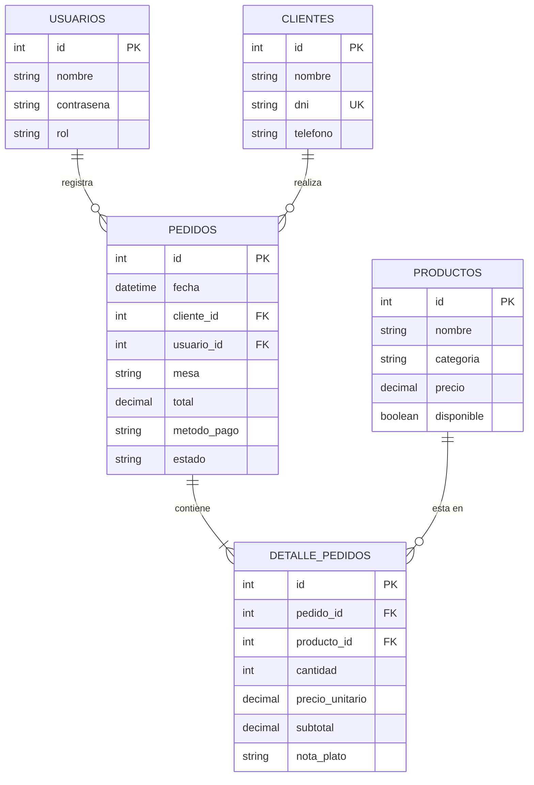

# Manual Técnico y de Usuario: El Rincón Criollo

---

## 1. Introducción y Arquitectura del Sistema
"El Rincón Criollo" es una aplicación de escritorio desarrollada en Python bajo el patrón arquitectónico **Modelo - Vista - Controlador (MVC)**, con persistencia en **MySQL Server** a través del driver oficial `mysql-connector-python`.

### Separación de Responsabilidades:
```text
      [Usuario / Operador]
               │
               ▼
       ┌───────────────┐
       │     VISTA     │  (CustomTkinter + ttk.Treeview)
       └───────┬───────┘
               │  Eventos de interfaz
               ▼
       ┌───────────────┐
       │  CONTROLADOR  │  (Lógica de negocio, RAM, Decimal, regex re)
       └───────┬───────┘
               │  Consultas y Transacciones
               ▼
       ┌───────────────┐
       │    MODELO     │  (Consultas SQL parametrizadas %s)
       └───────┬───────┘
               │
               ▼
       ┌───────────────┐
       │     MySQL     │  (Tablas relacionales vía XAMPP)
       └───────────────┘
```

---

## 2. Modelo Entidad - Relación (E-R)



---

## 3. Diccionario de Datos

### Tabla: `usuarios`
| Campo | Tipo | Nulo | Clave | Descripción |
| :--- | :--- | :---: | :---: | :--- |
| `id` | `INT` | NO | PK | Identificador único autoincremental del usuario. |
| `nombre` | `VARCHAR(50)` | NO | - | Nombre de usuario para iniciar sesión. |
| `contrasena` | `VARCHAR(100)` | NO | - | Clave de acceso al sistema. |
| `rol` | `VARCHAR(20)` | NO | - | Rol del usuario (`administrador`, `vendedor`). |

### Tabla: `clientes`
| Campo | Tipo | Nulo | Clave | Descripción |
| :--- | :--- | :---: | :---: | :--- |
| `id` | `INT` | NO | PK | Identificador único del cliente. |
| `nombre` | `VARCHAR(100)` | NO | - | Nombres y apellidos completos. |
| `dni` | `VARCHAR(8)` | NO | UK | Documento de identidad (único, 8 dígitos). |
| `telefono` | `VARCHAR(15)` | SÍ | - | Teléfono o celular de contacto. |

### Tabla: `productos`
| Campo | Tipo | Nulo | Clave | Descripción |
| :--- | :--- | :---: | :---: | :--- |
| `id` | `INT` | NO | PK | Identificador del plato o bebida. |
| `nombre` | `VARCHAR(100)` | NO | - | Nombre del plato criollo. |
| `categoria` | `VARCHAR(50)` | NO | - | Categoría (Entradas, Platos de Fondo, etc.). |
| `precio` | `DECIMAL(10,2)` | NO | - | Precio de venta al público en Soles. |
| `disponible` | `BOOLEAN` | NO | - | Estado en carta (`TRUE` activo, `FALSE` agotado). |

### Tabla: `pedidos`
| Campo | Tipo | Nulo | Clave | Descripción |
| :--- | :--- | :---: | :---: | :--- |
| `id` | `INT` | NO | PK | Número de comanda / ticket de venta. |
| `cliente_id` | `INT` | SÍ | FK | Referencia al cliente que realiza el pedido. |
| `usuario_id` | `INT` | SÍ | FK | Referencia al cajero/usuario que cobró. |
| `mesa` | `VARCHAR(20)` | NO | - | Ubicación o número de mesa (*Mesa 01*, *Barra*). |
| `metodo_pago` | `VARCHAR(20)` | SÍ | - | Modalidad de cobro (*Efectivo*, *Yape*, *Tarjeta*). |
| `total` | `DECIMAL(10,2)` | NO | - | Monto total general liquidado. |
| `estado` | `VARCHAR(20)` | NO | - | Estado de la venta (*Pagado*, *Pendiente*). |
| `fecha` | `DATETIME` | NO | - | Marca de tiempo generada automáticamente. |

### Tabla: `detalle_pedidos`
| Campo | Tipo | Nulo | Clave | Descripción |
| :--- | :--- | :---: | :---: | :--- |
| `id` | `INT` | NO | PK | Identificador del renglón de venta. |
| `pedido_id` | `INT` | NO | FK | Referencia al pedido cabecera. |
| `producto_id`| `INT` | NO | FK | Referencia al plato consumido. |
| `cantidad` | `INT` | NO | - | Unidades solicitadas (mínimo 1). |
| `precio_unitario`| `DECIMAL(10,2)`| NO | - | Precio congelado al momento de la venta. |
| `subtotal` | `DECIMAL(10,2)`| NO | - | Subtotal calculado (`cantidad * precio_unitario`). |
| `nota_plato` | `VARCHAR(150)`| SÍ | - | Observación para cocina (*sin ají*, *término 3/4*). |

---

## 4. Requerimientos de Instalación y Despliegue

### Requisitos de Software:
* **Sistema Operativo:** Windows 10/11, macOS o Linux.
* **Python:** Versión 3.10 o superior instalada.
* **Servidor Local:** XAMPP (con servicios Apache y MySQL activados).

### Pasos de Despliegue:
1. **Clonar el proyecto:**
   ```bash
   git clone https://github.com/Alex-Cardenas76/Restaurante_Criollo.git
   cd Restaurante_Criollo
   ```
2. **Crear y activar el entorno virtual:**
   ```powershell
   python -m venv .venv
   .venv\Scripts\activate
   ```
3. **Instalar dependencias oficiales:**
   ```powershell
   pip install -r requirements.txt
   ```
4. **Configurar el archivo `.env`:**
   ```powershell
   copy .env.example .env
   ```
   *Verificar que `DB_HOST=localhost`, `DB_PORT=3306`, `DB_USER=root`, `DB_PASSWORD=` y `DB_NAME=el_rincon_criollo`.*
5. **Configurar la base de datos en phpMyAdmin:**
   - Iniciar **Apache** y **MySQL** en el panel de XAMPP.
   - Navegar a `http://localhost/phpmyadmin`.
   - Crear la base de datos: `el_rincon_criollo`.
   - Importar y ejecutar el script [database/schema.sql](file:///C:/Users/ACER/Desktop/Criollo/database/schema.sql).
6. **Ejecutar el software:**
   ```powershell
   python main.py
   ```

---

## 5. Guía de Usuario (Manual de Operación)

### 1. Inicio de Sesión (Login)
* Ingrese el usuario `admin` y la contraseña `admin123`.
* Presione **"Ingresar al Sistema"**. Si los datos son válidos, accederá al panel principal.

### 2. Panel Principal (Dashboard)
* En la parte superior derecha se exhibe el usuario activo y su rol actual.
* El menú lateral izquierdo permite alternar instantáneamente entre:
  * **Gestión de Clientes**
  * **Carta y Productos**
  * **Caja y Pedidos**
  * **Cerrar Sesión**

### 3. Registro de Clientes
* Ingrese el DNI (exactamente 8 números), Nombres y Teléfono del cliente.
* Presione **"Guardar Cliente"**.
* El sistema validará que el DNI no esté duplicado y actualizará automáticamente la tabla interactiva inferior.

### 4. Registro de Platos en la Carta
* Ingrese el nombre del plato criollo, elija su categoría en el menú desplegable y escriba el precio en Soles.
* Puede activar o desactivar la casilla **"Disponible"** según el stock del día en cocina.
* Presione **"Registrar Plato"**.

### 5. Toma de Comanda y Cobro en Caja (Flujo Principal)
1. **Datos del Comprobante:** Seleccione el cliente (o use el cliente por defecto *Público General*), escriba la mesa (*Mesa 01*, *Barra*) y escoja el método de pago (*Efectivo*, *Yape*, *Tarjeta*).
2. **Agregar Platos:** Elija un plato del menú desplegable, defina la cantidad y agregue una nota de cocina si el cliente tiene alguna preferencia (*ej: sin ensalada*).
3. **Cálculo en RAM:** Al presionar **"+ Agregar"**, el plato se añade a la tabla del carrito y el sistema recalcula en tiempo real el monto total a pagar. Si se equivoca, puede seleccionar una fila y presionar **"- Quitar"**.
4. **Finalizar Venta:** Presione **"Registrar y Cobrar Pedido"**. El sistema guardará la transacción completa en MySQL y emitirá un mensaje con el número de ticket generado.
